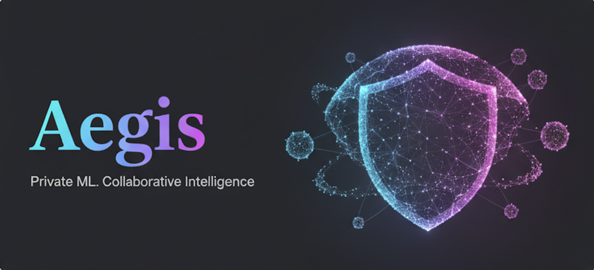

<p align="center">
  
</p>

# Aegis
Private ML. Collaborative Intelligence.

> Promise: From baseline to audit in under an hour. Epsilon budgeted. RBAC enforced. Reports ready.

<!-- Badges: real links for License; CI and Docker are placeholders until wired -->
<p>
  <a href="LICENSE"></a>
  <!-- TODO: Replace with real badge when CI is wired -->
  
  <!-- TODO: Replace with real Docker pulls badge after publishing image -->
  
  
</p>

Aegis is the open-source, compliance‑first orchestration layer for privacy‑preserving ML. It puts Differential Privacy (DP) and Federated Learning (FL) to work in real production—API‑first, audited, observable, and deployable on Docker/Kubernetes.

## Why Aegis (in one breath)
Ship private models faster—with hard privacy guarantees, enterprise controls, and audit‑ready reports. No vendor lock‑in. Python native. Batteries included.

## Why Aegis over the rest (the truth)
Most FL/DP tools give you parts. Aegis gives you the whole product.

- Others give you a library; we give you a platform.
  - Not just DP primitives or an FL loop, but an API, CLI, security controls, dashboards, and compliance reporting—wired together.
- Others make privacy optional; we make it operational.
  - Epsilon targeting, step‑wise accounting, and budget guardrails are first‑class—not a README footnote.
- Others lock you in; we set you free.
  - Open‑source, Flower‑based orchestration, Opacus DP, and standard Docker/Kubernetes deployments.
- Others bolt on compliance; we bake it in.
  - Tamper‑evident audit logs, RBAC, mTLS, and one‑click Markdown/PDF reports you can hand to regulators.

This is the difference between a toolkit and a product. Between a demo and a deployment.

## What you get out‑of‑the‑box
- Differential Privacy you can govern
  - DP‑SGD via Opacus, epsilon targeting and step‑wise accounting; clipping, noise, sample rate, and delta as first‑class parameters.
  - Guardrails and validation for privacy budgets; epsilon consumption surfaced in dashboards.
- Federated learning that’s robust, not fragile
  - Flower orchestration with selectable robust aggregators (Krum, Trimmed Mean), participant authentication, straggler policy, and basic health.
- Security and compliance built‑in
  - mTLS, RBAC (admin/operator/viewer), structured audit logs with hash chaining.
  - One‑click compliance reports (Markdown/PDF) with GDPR/HIPAA/EU AI Act mappings and DPIA‑style risk notes.
- Production ergonomics
  - FastAPI with OpenAPI schema, CLI, and industry playbooks (HIPAA/PCI/GDPR) to run full workflows without touching code.
  - Prometheus/Grafana prewired; warmup script for lively dashboards; Docker/Kubernetes deploy artifacts.

## 5‑minute Quickstart

1) Start the stack
```zsh
make docs-up
```

2) Run a playbook (HIPAA/PCI/GDPR)
```zsh
bash docs/playbooks/healthcare_hipaa.sh
```

3) Watch dashboards and produce a report
```zsh
# Grafana
open http://localhost:3000

# Status (viewer role)
curl -fsS -H 'X-Role: viewer' 'http://localhost:8000/training/status?session_id=hipaa_run' | jq .

# Compliance report (Markdown)
curl -fsS -H 'X-Role: viewer' 'http://localhost:8000/compliance/report' | jq -r .markdown > report.md
```

Teardown:
```zsh
make docs-down
```


## Architecture at a glance
- Privacy Engine (`aegis/privacy_engine.py`): Opacus DP‑SGD, RDP accounting, epsilon targeting.
- Federated Coordinator (`aegis/federated_coordinator.py`): Flower strategy; Krum & Trimmed Mean; auth & retries.
- API (`aegis/api.py`): FastAPI; mTLS, RBAC, audit logs; OpenAPI schema.
- Compliance Reports (`aegis/compliance/report.py`): Markdown/PDF; versions captured.
- Deploy (`deploy/`): Docker Compose, Kubernetes, Helm; secrets and healthchecks.

## Observability & security
- Prometheus/Grafana provisioned; dashboards show RPS, latency, errors, epsilon consumption, scrape health.
- Security tests include membership inference/model inversion; RBAC & mTLS are validated in tests and examples.

## Who uses Aegis
- Healthcare collaboratives (HIPAA)
- Financial institutions (PCI)
- Retailers & advertisers (GDPR)

## How Aegis compares
- Open, portable stack vs. vendor lock‑in; production features missing in raw FL/DP libraries.
- Compliance and audit “baked in,” not bolted on.
- Works with PyTorch/scikit‑learn/TensorFlow examples; bring your own models.

### Competitor snapshot
- Flower — excellent orchestration (we build on it), but no integrated DP accounting, RBAC/mTLS, or compliance reports.
- NVIDIA FLARE / OpenFL / FATE — strong for secure aggregation/MPC, heavier to operate; Aegis prioritizes DP governance + production ergonomics.
- FedML (SaaS) — managed convenience, but with vendor lock‑in; Aegis is open, on‑prem friendly.
- DP libraries (Opacus, TF‑Privacy, OpenDP) — great building blocks; Aegis is the production wrapper that unifies them.

## Roadmap highlights
- Optional secure aggregation modules; additional robust aggregation strategies
- Deeper policy presets for GDPR/HIPAA/PCI
- Extended attack simulations and reporting

## Contributing
We welcome issues and PRs. Please run:
```zsh
ruff check && pytest -q && python -m mkdocs build
```

---

Built and maintained by clyrai.

## License
Licensed under the Apache License, Version 2.0 (Apache-2.0). See `LICENSE` for details.


