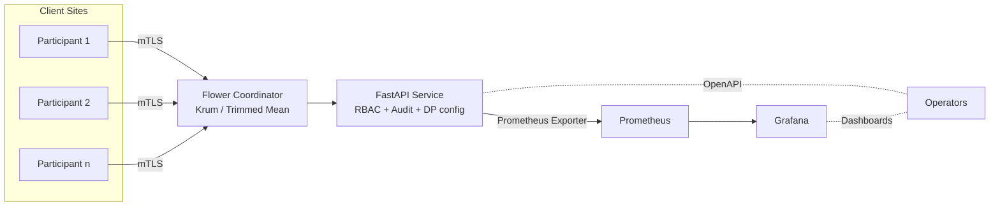

# Aegis architecture

Components
- API: FastAPI service providing dataset/participant registration, training lifecycle, DP config, strategy selection, and compliance reports. Enforces RBAC and emits JSON audit logs.
- Federated Coordinator: Flower-based server with robust aggregation (Krum, Trimmed Mean), participant auth, and straggler/retry policy.
- Privacy Engine: Opacus-based DP-SGD with RDP accounting, epsilon targeting, and step-wise accounting.
- Observability: Prometheus scrapes API metrics; Grafana presents dashboards (traffic, latency, epsilon consumption, health).

Security boundaries
- Transport: TLS everywhere; mTLS between coordinator and participants (clients present certs). In K8s, store keys in Secrets and mount as files.
- Access control: RBAC roles (admin/operator/viewer) enforced at API; sensitive endpoints gated.
- Audit: JSON-structured, tamper-evident chainable logs (timestamp, actor, action, params hash, outcome).

Data flow
1. Operators configure DP/strategy via API.
2. Clients train locally and send updates to coordinator (mTLS).
3. Coordinator aggregates updates and triggers next round.
4. API exposes progress/metrics; Prometheus scrapes; Grafana displays.
5. Compliance report generated on demand with DP config, audit summary, and regulatory mappings.

Trust model and assumptions
- Clients hold their own raw data; only model updates leave the site.
- DP-SGD noise/clipping limit individual contribution; robust aggregation mitigates some Byzantine behavior.
- API authentication/authorization is enforced by RBAC and your upstream IdP/gateway.
