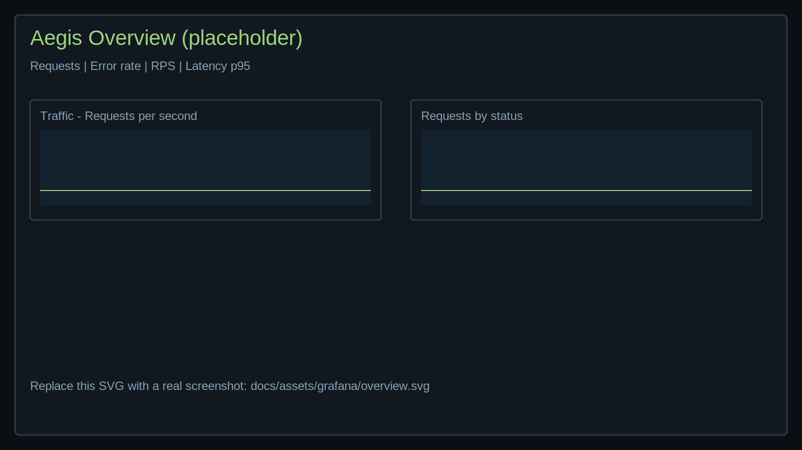

# Observability and dashboards

Prometheus
- Targets: Aegis API at /metrics
- Check readiness at /-/ready

Grafana
- Default Prometheus datasource provisioned
- Aegis overview dashboard preloaded
- Monitor: request rates, error rates, latency, epsilon usage, scrape health

Dashboard tour (screenshots)
- Overview
	
- Latency & breakdowns
	
- Health
	

Tips
- Filter by `session_id` to isolate a single run (match the `SESSION_ID` from your playbook script logs).
- Use time range pickers (e.g., Last 15 minutes) during short demo runs.

Alerts (suggestions)
- High error rate over rolling 2–5m
- Scrape failures or slow scrape durations
- Excessive epsilon consumption vs target

Copy‑paste checks
```zsh
# Prometheus readiness
curl -fsS http://localhost:9090/-/ready | grep -q 'ready' && echo OK || echo NOT_READY

# Grafana health (Grafana's own API)
curl -fsS http://localhost:3000/api/health | jq .

# Aegis API health (note: endpoint is /healthz)
curl -fsS http://localhost:8000/healthz | jq .

# Aegis API metrics endpoint
curl -fsS http://localhost:8000/metrics | head -n 20
```

Tools
- Install `jq` if you want pretty JSON: `brew install jq`
