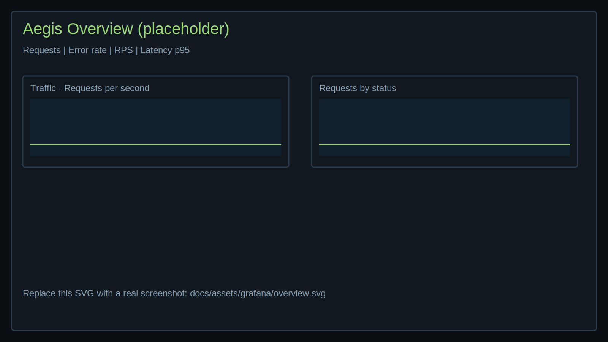

# Run playbook scripts (HIPAA/PCI/GDPR)

This guide mirrors the structure of "Train a model" but uses the production playbook scripts to orchestrate end-to-end runs with Differential Privacy (DP) and Federated Learning (FL).

> Important
> - These scripts automate the Aegis API flow (participants → DP config → strategy → start/poll → report).
> - In the dev stack, a lightweight simulator runs rounds so you can validate orchestration and privacy accounting quickly.
> - For real models, see the example model guides listed below.

Prerequisites
- Stack running locally (see `technical/getting_started.md`)
- Tools: `bash`, `curl`, `jq`
- Install on macOS:
  ```zsh
  brew install curl jq
  ```

What this guide is / is not
- Is: A step-by-step script-driven workflow (with Grafana monitoring and compliance outputs).
- Is not: A model architecture tutorial (see example model pages below).

Choose your industry playbook
- Healthcare (HIPAA): `docs/playbooks/healthcare_hipaa.sh`
- Finance (PCI): `docs/playbooks/finance_pci.sh`
- Retail (GDPR): `docs/playbooks/retail_gdpr.sh`

0) Start the stack (once per session)
- Using Makefile (recommended):
  ```zsh
  make docs-up
  ```
- Or with Docker directly:
  ```zsh
  docker compose -f deploy/docker-compose.yml up -d
  ```
- Stop when finished:
  ```zsh
  make docs-down
  # or
  docker compose -f deploy/docker-compose.yml down -v
  ```

1) (Optional) Set environment variables
- You can tune endpoints, TLS/mTLS, and DP/FL parameters before running a script.
- Common variables:
  - `BASE_URL` (default `http://localhost:8000`)
  - `GRAFANA_URL` (default `http://localhost:3000`)
  - `SESSION_ID` (auto if not set), `ROUNDS`, `STRATEGY` (`krum` | `trimmed_mean`)
  - DP knobs: `CLIP`, `NOISE`, `SAMPLE_RATE`, `DELTA`, `ACCOUNTANT`
  - Output: `ARTIFACT_DIR` (default `test_artifacts`)
  - Networking: `TIMEOUT`, `RETRIES`, `RETRY_DELAY`
  - TLS/mTLS: `INSECURE`, `CLIENT_CERT`, `CLIENT_KEY`, `CA_CERT`, `CURL_EXTRA_ARGS`
  ```zsh
  export BASE_URL=https://aegis.internal:8443
  export GRAFANA_URL=http://localhost:3000
  export ROUNDS=8 STRATEGY=krum NOISE=1.2 CLIP=1.0 SAMPLE_RATE=0.01 DELTA=1e-6 ACCOUNTANT=rdp
  export CLIENT_CERT=~/.certs/client.crt CLIENT_KEY=~/.certs/client.key CA_CERT=~/.certs/ca.pem
  export TIMEOUT=20 RETRIES=60
  ```

2) Run a playbook
- Execute one script to run the full flow; it will write a Markdown compliance report under `test_artifacts/`.
```zsh
bash docs/playbooks/healthcare_hipaa.sh   # HIPAA-leaning defaults
bash docs/playbooks/finance_pci.sh        # PCI-leaning defaults
bash docs/playbooks/retail_gdpr.sh        # GDPR-leaning defaults
```

3) Monitor progress in Grafana
- Open `GRAFANA_URL` (default `http://localhost:3000`) and use the Observability guide for dashboards:
  - `technical/observability_and_dashboards.md`
    - That page embeds screenshots to help you recognize key panels.
- Sample overview panel:

  

- Suggested panels: training rounds, accuracy/loss per round, epsilon estimate, client health.
- Tip: Filter dashboards by `session_id` (the script logs print your `SESSION_ID`).

4) (Optional) Check status via API
- The scripts already poll and log status. You can also query the API directly:
```zsh
curl -fsS -H 'X-Role: viewer' "${BASE_URL:-http://localhost:8000}/training/status?session_id=${SESSION_ID:-run1}" | jq .
```

5) Review the compliance report
- The script writes a Markdown report to `test_artifacts/report_<SESSION_ID>.md`.
- Share this with non‑technical stakeholders; it includes DP config, strategy, participants, and audit summary.

6) Tear down (optional)
```zsh
docker compose -f deploy/docker-compose.yml down -v
```

Tips
- Strategy: Use Krum for Byzantine resilience; Trimmed Mean for robust averaging.
- Privacy: Lower epsilon (via higher `NOISE`) = stronger privacy but more noise; evaluate utility impact.
- Security: In production, enforce mTLS and RBAC; rotate keys and store audit logs immutably.

Try it (quick examples)
```zsh
# HIPAA playbook with mTLS and extended timeouts
BASE_URL=https://aegis.internal:8443 \
CLIENT_CERT=~/.certs/client.crt CLIENT_KEY=~/.certs/client.key CA_CERT=~/.certs/ca.pem \
TIMEOUT=20 RETRIES=60 bash docs/playbooks/healthcare_hipaa.sh

# PCI playbook with Krum and stricter DP noise
STRATEGY=krum NOISE=1.2 bash docs/playbooks/finance_pci.sh

# GDPR playbook to a different Grafana URL
GRAFANA_URL=http://grafana.local:3000 bash docs/playbooks/retail_gdpr.sh
```

Related docs
- Production playbooks overview: `technical/playbooks.md`
- Scripts folder readme: `docs/playbooks/README.md`
- Orchestration via API (manual): `technical/train_model.md`
- Observability & dashboards: `technical/observability_and_dashboards.md`
- Federation strategies: `technical/federation_strategy_guide.md`
- Privacy tuning: `technical/privacy_tuning_playbook.md`
